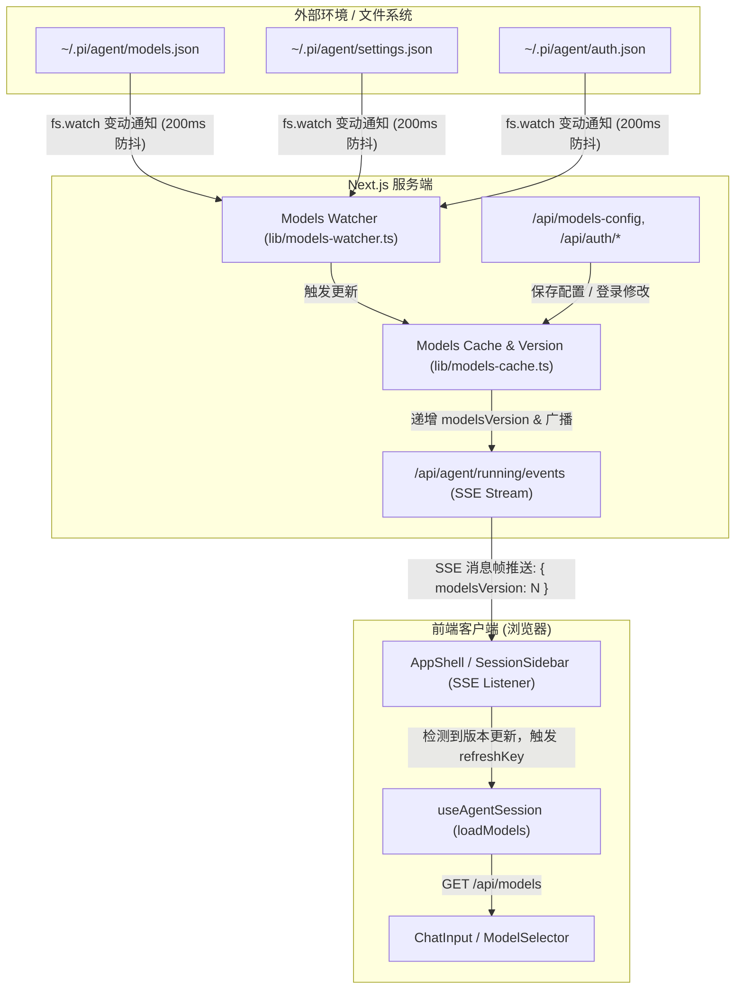

# 模型列表随 Provider 与配置文件自动变更同步设计方案

## 1. 背景与痛点
在 `pi-agent-desktop` 中，模型列表（`modelList`）目前仅在应用初次挂载、切换工作区 `cwd` 或手动关闭设置窗口时才被动请求 `/api/models`。
当发生以下情况时，前端无法感知到模型变化：
1. 外部工具（如终端 `pi` CLI、文本编辑器等）修改了 `~/.pi/agent/models.json`、`settings.json`（模型规则）或 `auth.json`（认证密钥）；
2. 用户在应用内置的模型设置（Settings -> Models）中保存了新的 Provider 配置、添加了通过发现接口获取的模型，或者完成了 OAuth 登录 / API Key 设置，但未关闭弹窗；
3. 后端模型缓存过期后，前端未收到任何提醒，页面上依然展示旧的模型列表。

## 2. 总体架构与数据流



## 3. 详细设计规范

### 3.1 服务端模型版本与通知 (`lib/models-cache.ts` & `lib/rpc-manager.ts`)
- **`modelsVersion` 全局版本计数**：
  在 `lib/models-cache.ts` 中维护全局版本号 `modelsVersion`（从 1 开始递增），导出 `getModelsVersion(): number`。
- **缓存失效联动**：
  `invalidateModelsCache()` 在清空内存缓存的同时递增 `modelsVersion`，并调用广播函数 `notifyRunningChange()`（复用现有的全局广播发布通道）。
- **主动触发场景**：
  - `/api/models-config`（PUT 保存）
  - `/api/auth/login/[provider]`、`/api/auth/logout/[provider]`
  - `/api/auth/api-key/[provider]`
  - `/api/project-trust`
  - 外部配置文件发生变化

### 3.2 配置文件实时监听器 (`lib/models-watcher.ts`)
- **监控目标目录**：`getAgentDir()`（默认 `~/.pi/agent/`）。
- **关注文件**：`models.json`、`settings.json`、`auth.json`。
- **跨平台与防抖保障**：
  - 使用 `fs.watch` 监听目录或目标文件；
  - 针对 Windows 下文件修改触发多次连续事件的问题，内置 200ms 防抖；
  - 记录各文件的 `mtimeMs` 和 `size`，只有当文件的实际修改时间或尺寸发生改变时才触发刷新，避免无意义的自增；
  - 优雅处理文件被暂时锁定、删除后重建等边缘情况。
- **服务常驻与单例保障**：在 Next.js 服务端以单例形式初始化挂载在 `globalThis` 上，避免在开发环境下因热重载创建重复监听。

### 3.3 SSE 事件流扩展 (`/api/agent/running/events`)
- 在推送的数据包中加入 `modelsVersion`：
  ```json
  {
    "type": "running",
    "runningSessionIds": [...],
    "sessionListVersion": 3,
    "modelsVersion": 5
  }
  ```
- 客户端初次连接的 Initial Snapshot 和每一次心跳/变动推送均携带当前权威的 `modelsVersion`。

### 3.4 前端客户端感知与安全容错 (`AppShell.tsx` / `useAgentSession.ts`)
- **版本比对与拉取**：
  - 前端建立 `appliedModelsVersionRef`，在 SSE `onmessage` 收到 `data.modelsVersion` 时：
    ```ts
    if (typeof data.modelsVersion === "number" && data.modelsVersion !== appliedModelsVersionRef.current) {
      appliedModelsVersionRef.current = data.modelsVersion;
      setModelsRefreshKey((k) => k + 1);
    }
    ```
- **窗口前台唤醒**：在 `visibilitychange`（切换回当前标签页）和 `window.addEventListener("online")` 时触发一次连接恢复或核验，确保后台断网唤醒后秒级同步。
- **选模安全平滑降级**：
  - 模型重载后，若当前选中的模型已不在新列表中（例如外部删除了该模型），前端自动安全回退至当前 Provider 的推荐可用模型或系统默认的 `defaultModel`，并弹出温和的通知告知用户，防止悬空模型导致发送消息报错。

## 4. 测试与验证方案
1. **监听器测试 (`lib/models-watcher.test.mjs`)**：
   - 模拟修改临时目录中的 `models.json` 和 `settings.json`，验证监听器是否在 200ms 防抖后准确触发一次回调；
2. **版本号与缓存测试 (`lib/models-cache.test.mjs`)**：
   - 验证 `invalidateModelsCache()` 能够正确递增版本并在并发加载下保证一致性；
3. **SSE 帧测试 (`app/api/agent/events-route.test.mjs`)**：
   - 验证事件流返回包含 `modelsVersion` 字段的正确 JSON；
4. **端到端行为验证**：
   - 外部通过写文件方式新增模型 -> 观察客户端主界面下拉列表是否在 1 秒内自动呈现新模型。
